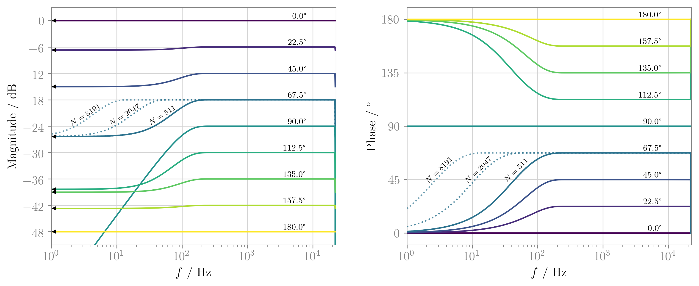
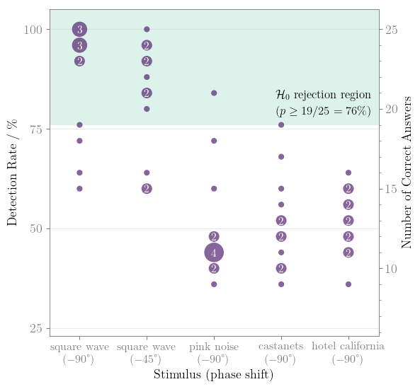

# audibility-constant-phase
Audibility of Constant Phase Shifts in Audio Signals

The compiled paper can be found on our [blog](
http://spatialaudio.net/paper-detection-of-constant-phase-shifts-in-filters-for-sound-field-synthesis/)

## Theory
Filters with unit magnitude (except for DC) and constant phase shift are known as
fractional Hilbert transforms.

Constant phase shifts of +45deg or +90deg occur in sound field synthesis (SFS)
equalisation tasks, there with an additional highpass slope, making them so called
half or full differentiators.

Since no perceptual studies are known to the authors whether the existence or
absence of such a constant phase shift is audible, this project initiates this
research questions.
Although, initially motivated from SFS background, the question actually belongs
to fundamental human hearing and audiology research.

We give analytic expressions for the fractional Hilbert transform filter and
their suitable practical implementation.
Furthermore we discuss an initial listening experiment exploring the perceptibility
of constant phase shifts.

## Open Science

This project is following the open science paradigm.
All information is thus archived in the Github hosted repository

https://github.com/spatialaudio/audibility-constant-phase

under the CC BY 4.0 and MIT license.  refers to the repository state when submitting the paper.

We provide single modifications of the webMUSHRA software , thus explicitly
indicating the usage of a "Third-Party Modified Version of the webMUSHRA Software"
in our listening experiment and retaining `LICENSE.txt`, `THIRD-PARTY-NOTICES.txt`
of the webMUSHRA software.

## Conference Paper

This git repository is accompanied by the paper

Frank Schultz, Nara Hahn, Sascha Spors, University of Rostock (2019):
*Detection of Constant Phase Shifts in Filters for Sound Field Synthesis*,
[5th Intl Conf on Spatial Audio (ICSA)](https://vdt-icsa.de/program/),
Ilmenau, September 2019, ORAL-5-3, abstract reviewed paper

The sources are included in the `paper` folder using the free `IEEEtran` latex
class, rather than the ICSA template.

## Conference Talk

The corresponding talk to the above mentioned paper was given at
[5th Intl Conf on Spatial Audio (ICSA)](https://vdt-icsa.de/program/),
Ilmenau, September 2019, ORAL-5-3.

The corresponding sources are included in the `talk` folder.

## Notebooks

There are several Jupyter notebooks containing fundamental signal processing
calculus and validation routines.

The main derivations and aspects are covered in `aperiodic-signal-constant-phase-shifter.ipynb`
and `periodic-signal-constant-phase-shifter.ipynb`.

The `mkfig-xxx.py` Python scripts render graphics that are directly used in the
paper and the slides for the talk.

Furthermore, Python standalone code handle generation of stimuli.

## Anaconda Environment
Python software and Jupyter notebooks were programmed and validated under Linux
OS and Mac OSX 10.13.6 and 10.14.4. The anaconda environment `anaconda_env.yml`
was used to prepare all stimuli and analyse the test results.

## ABX Test Framework

We utilise the webaudio-based [webMUSHRA](https://github.com/audiolabs/webMUSHRA)
software

as of version:
[master c929877](https://github.com/audiolabs/webMUSHRA/commit/c929877e9bdc56ff5f0b26460219787e6e31537d)
to realise webbrowser based ABX testing.

See Schoeffler, M. et al., (2018). webMUSHRA - A Comprehensive
Framework for Web-based Listening Tests. Journal of Open Research Software.
6(1), p.8

We used virtual webserver (localhost).

### Install webMUSHRA

Working with webMUSHRA on a local machine is pretty straightforward if the
computer can handle local webserver services (i.e. setting up a virtual
webserver with PHP).

To install all software, please do the following initial steps:

1.) Get the repository data with SSH at git@github.com:spatialaudio/audibility-constant-phase.git

The repository folder/file structure contains a
subfolder `abx_software/webMUSHRA_c929877_20180814`.

2.) Get the zipped version of webMUSHRA or directly clone its
[master commit c929877](https://github.com/audiolabs/webMUSHRA/commit/c929877e9bdc56ff5f0b26460219787e6e31537d)
into `abx_software/webMUSHRA_c929877_20180814`

It is very likely that the webMUSHRA [releases 1.3 and 1.4](https://github.com/audiolabs/webMUSHRA/releases)
will work as well, however we did not test this!

3.) Some versioned files of the `audibility-constant-phase` repository
appear to be modified or deleted, when copying the webMUSHRA stuff into the
folder.
So, check with `git status`, `git a`. Please, revert these changes in order to
work with our intended test design, i.e. a "Third-Party Modified Version of the
webMUSHRA Software".
Especially, make sure that `index.html` calls `MushraAudioControlSinglePlay.js`.

The next subsection explains the reasons.

### webMUSHRA Modifications

As mentioned above "Third-Party Modified Version of the webMUSHRA Software"
was used in the listening experiment. This was due to our following requirements.

#### Audio Rendering

webMUSHRA by default renders looped playback with fade-out / fade-in when
switching and looping stimuli, presumably intending seamless switching.

Crossfading or fast fade-out/fade-in between ABX stimuli in our test scenario
produces highly detectable artefacts due to different phase alignment of the
reference vs. the phase shifted audio versions.
These switching artefacts are not what we are being after for, but rather
detection / audibility of constant phase shifts.

That's why we've implemented some modifications.
To meet our special requirements of audio rendering as

* non-looped playback
* always enforcing stop before triggering a new stimulus from start
(i.e. no crossfade, no fade-out / fade-in with very short time interval between
stimulus change)

the ABX related audio rendering engine written in JavaScript
`abx_software/webMUSHRA_c929877_20180814/lib/webmushra/audio/MushraAudioControl.js`
was slightly modified to `MushraAudioControlSinglePlay.js`,
which needs loaded in the modified `abx_software/webMUSHRA_c929877_20180814/index.html`.

#### GUI Appearance

The initial GUI includes logos of the involved institutions that create webMUSHRA.
We highly appreciate their efforts, it is a very useful tool.
However, we felt that these logos are diverting too much attention to the
actual ABX detection task. So we left these logos out in `index.html`.
Maybe, it is worth to consider a promo-webpage at the beginning or at the end of
the test that explicitly shows these logos and some other useful information
one-time, leaving the actual test page cleaned up.

#### GUI Language and Labeling

In `abx_software/webMUSHRA_c929877_20180814/lib/webmushra/nls/nls.js`
we changed to

    nls['de']['stopButton'] = "Stop";
    nls['de']['pauseButton'] = "Stop";
    nls['de']['reference'] = "X";
    nls['de']['quest'] = "Welcher Stimulus ist X?";

exchanging "Reference" to the more appropriate term "X", since for the test
subject it is not relevant and even might a biasing information what is defined
as reference. The labeling A, B and X comes with no bias and appears more
consistent.
Furthermore, since we always start stimulus from beginning, there is no
pause, but only stop.

In `abx_software/webMUSHRA_c929877_20180814/startup.js` we changed to

    if (config.language == undefined) {
        config.language = 'de';
    }

using german language in the GUI.

### ABX Test Configuration

#### Listening Test

In
`abx_software/webMUSHRA_c929877_20180814/configs`
running the Jupyter notebook `Phase_ABX_create_yaml.ipynb`
creates a yaml file that configures the webMUSHRA for the dedicated ABX test.
Thus, something like `ABX_SchultzHahn19_0.yaml` is written to the same folder.
Furthermore the same file name with suffix .txt includes information of the
ABX trials. Note that the actual playing sequence is randomised by webMUSHRA API.

Make sure, that the referenced stimuli of the yaml are stored in
`abx_software/webMUSHRA_c929877_20180814/configs/resources/stimuli`.
Again, if the test appears to be loading forever, it is very likely that audio files
are not found in this specified folder.

In our test parts 0-3 were used, for which
`ABX_SchultzHahn19_0.yaml`, `ABX_SchultzHahn19_1.yaml`, `ABX_SchultzHahn19_2.yaml`, `ABX_SchultzHahn19_3.yaml`
were created, using 7,6,6 and 6 repetitions of ABX trials of the same
audio content.
Thus, for 5 audio contents, for 0th part 5 x 7=35 trials had to be performed,
the other parts consisted of 5 x 6=30 trials.

#### Training

In
`abx_software/webMUSHRA_c929877_20180814/configs`
running the Jupyter notebook `Training_ABX_create_yaml.ipynb`
creates `ABX_SchultzHahn19_Training.yaml`,
which realises a training session prior to the actual listening test.

For that the pink noise stimuli `pnoise_ref.wav` (0 dB level) and `pnoise_treat` (-1dB level)  (created by `notebooks/generate_pink_noise.ipynb`) are used in a four trial ABX session.
The detection task of different loudness is rather simple and should make test
subjects with the ABX GUI.
It is important that test subjects do not get an idea of the actual research
question within the training phase.

### Audio Content and Stimulus Generation

For the ABX test we used the musical audio content

* [castanets-dry](https://iaem.at/Members/frank/sounds/castanets-dry) (Matthias Frank's (IEM Graz) version of
EBU SQAM CD track 27 re-programmed as anechoic version)
* [Hotel California, Hell Freezes Over, Eagles, Geffen, 1994](https://en.wikipedia.org/wiki/Hell_Freezes_Over), stereo mix downmixed to mono
(if the original record is not at hand, `hotelcalifornia_mono_fake.wav` might give an impression of the rhythmic structure of the song)

and the the artificial audio content (generated with provided source code)

* lowpass filtered pink noise generated by `generate-nonperiodic-stimuli.py`
* square wave bursts generated by `generate-periodic-stimuli.py`

Note that reference audio material is mono!

The python scripts `generate-periodic-stimuli.py` and `generate-nonperiodic-stimuli.py`
take care of the stimulus generation used for the dedicated ABX test.

`generate-nonperiodic-stimuli.py` can load full songs as **mono** wav files
and renders phase shifted stimuli from the specified sample interval
[n_start, n_stop] as 24 Bit non-dithered PCM wav.
Note that the `filter_order` is a crucial parameter.
If the FIR filter length is too small, very low frequency and very high
frequency ripples in the magnitude response will occur, which
obviously reveals the phase shifted manipulation by different bass level
perception.

Note, that we treat pink noise (which is generated within
`generate-nonperiodic-stimuli.py`)
as a full song audio content rather than a periodic sequence.

Considering the two audio contents (Hotel California and pink noise)
as rectangular windowed signals of infinite
duration, the filter order of 3.963.530 samples (≈ 90s!) ensures that
linear convolution of the chosen excerpt of Hotel California is complete.
The same FIR filter was utilised for consistence for the pink noise stimulus.

Note that due to copyright restrictions, we use `hotelcalifornia_mono_fake.wav`
to create the stimuli used in the repository.
You might want to use the original record if at hand.

`generate-periodic-stimuli.py` is used for audio content for which a periodicity
is assumed, writing 24 Bit non-dithered PCM wav. This holds e.g. for square wave
bursts, kick drums of certain bpm tempo (not used in listening experiment) and
castanet rhythm.

For this audio material, the ideal, infinite phase shift filter can be applied.
See the signal processing section in the paper or the notebook for details.

Here, the crucial parameter is `t_period` that must ensure, the audio content
to be much shorter than `t_period` in order to avoid overlapped and aliased
convolution contributions.

Furthermore, in informal pretests we considered EDM music with very low crest
factor and other test stimuli, such as

* Tiesto & DallasK, Show Me (Original Mix), 2015
* AutoErotique, Asphyxiation, 2013
* Knife Party, 404, 2014,
* electronic kick drum library (tracks: sub_kick_23_G.wav, min_kick_22_G.wav, trad_kick_12_D.wav),
see https://soundcloud.com/8-bit-logic and http://99sounds.org/kick-drum/
* Meyer Sound's music noise signal MNoise_MSPN_90_916_049_15.wav, see https://m-noise.org/

but did not include it in the final listening test.

### Audio Hardware

We used an RME Fireface UC (firmware v126, driver v3.16, -10 dBV output
sensitivity) connected to an Apple Mac mini 2018 (OS 10.14.4).
Phones out (7/8) of the RME with -10 dB Fader Gain was connected to a
Sennheiser HD800 (#50526).
The pink noise stimulus `pnoise_ref.wav`
(created by `notebooks/generate_pink_noise.ipynb`)
played back on both channels leads to 68.8 dB(A)Leq / 83.8 dB(C)Peak on each
channel.
This was measured with the G.R.A.S 43AF headphone coupler kit using a RA0039
(#343741) ear simulator with the dedicated 40AG 1/2" microphone capsule (#333274).
The microphone was connected to a Bruel & Kjaer G-4 2270 sound pressure level
(SPL) meter (#3008532) via a customised G.R.A.S. 26AC-S6 preamplifier (#330170)
and was calibrated by B&K 4231 pistonphone (#3014273).
The measurement routine is according to the IEC 60318 standard.

`pnoise_ref.wav` signal statistics per channel (this file is diotic):

* sample peak =  -12.04 dB
* true peak =  -11.65 dB (by oversampling)
* RMS =  -25.15 dB
* loudness =  -26.89 dB LUFS (R128, ITU BS.1770/4)
* crest factor =  13.5 dB

All stimuli (except castanets, see below) for the listening test were
calibrated to a loudness of -23 dB LUFS. Thus, if `pnoise_ref.wav` would be
calibrated to -23 dB LUFS (by a gain of 3.89 dB) a SPL of
72.69 dBALeq / 87.69 dBCPeak is individually obtained for left and right
headphone channels measured with the above mentioned headphone-to-ear coupler.

The LUFS calculation for the castanet stimulus does not match the
perceived loudness very well in comparison to the other stimuli. Thus, we
calibrated castanets to -35 dB LUFS, instead of -23 dB LUFS by individual perception.

### Webserver Start / Stop

Since webMUSHRA relies on the webaudio technology, a HTML5 based interface
is provided.
This should be run on a server.
We used a virtual webserver (localhost) on our lab computer
(Apple Mac mini 2018, Mojave 10.14.4).

To do so:

i) open a terminal and make sure that cd is `abx_software/webMUSHRA_c929877_20180814`.

ii) Then prepare the local webserver by  `php -S localhost:8000` (or any other suitable port).
Under windows and Linux OS, running a webserver might require further steps.

iii) Then, within a browser the URL
[http://localhost:8000/?config=ABX_SchultzHahn19_0.yaml](http://localhost:8000/?config=ABX_SchultzHahn19_0.yaml)
instantiates the ABX test based on the specified yaml file.

If the test appears to be loading forever, it is either very likely that audio
files are not found in the specified folder.
Or, another issue could be the yaml file itself.
So make sure, that you follow proper yaml identation and the format required by
webMUSHRA (see `complete.yaml`, `experimenter.md`), when you change the yaml
file manually.

The ABX test asks for age, gender before ending.
Submitting all the data, triggers writing of the results into
`abx_software/webMUSHRA_c929877_20180814/results/abx_constant_phase_shift/paired_comparison.csv`.
Then somehow the virtual webserver stops/crashes with a write segmentation
fault error (at least on our machines).

So, in the dedicated terminal, `Ctrl+C` and `php -S localhost:8000` runs a new
instance.

However, this issue is handy, since a re-start of the test can only be triggered
by means of the above provisions and not by accident.

### Analysis of ABX Test Results

ABX test results are stored in
`abx_software/webMUSHRA_c929877_20180814/results/abx_constant_phase_shift/paired_comparison.csv`
Make sure that you backup this file frequently, when running the test.
We provide it within the git repository.
Once the test is finished all test results will be stored within this file.

In
`abx_software/webMUSHRA_c929877_20180814/configs`
running the Jupyter notebook
`Phase_ABX_analysis.ipynb` reads this csv file and performs
sorting and an analysis of the data, which might require further customisation.

At the beginning of the notebook some considerations regarding the test
statistics are documentated based on [GPower3](http://www.gpower.hhu.de/), cf.
Faul, F., Erdfelder, E., Lang, A.-G., & Buchner, A. (2007).
*GPower 3: A flexible statistical power analysis program for the social,
behavioral, and biomedical sciences*. Behavior Research Methods, **39**,
175-191
